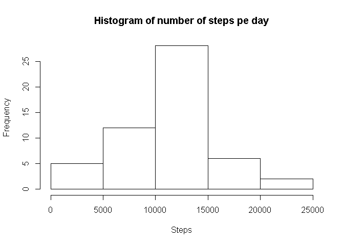
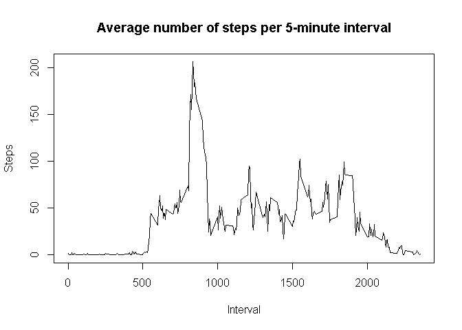
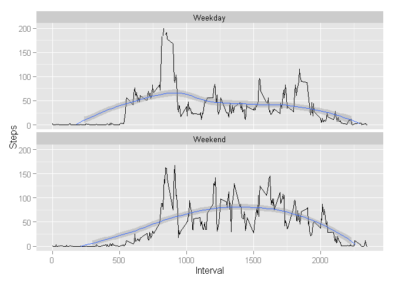

# Reproducible Research: Peer Assessment 1


## Loading and preprocessing the data

### Load data
Assuming data are stored in `activity.zip` in file named `activity.csv`. We can
create a connection object first and then read data easily from zip archive.

```r
con <- unz('./activity.zip', filename = 'activity.csv')
df <- read.csv(con, stringsAsFactors = FALSE)
```
Let's wee what data are loaded:

```r
str(df)
```

```
## 'data.frame':	17568 obs. of  3 variables:
##  $ steps   : int  NA NA NA NA NA NA NA NA NA NA ...
##  $ date    : chr  "2012-10-01" "2012-10-01" "2012-10-01" "2012-10-01" ...
##  $ interval: int  0 5 10 15 20 25 30 35 40 45 ...
```

```r
head(df)
```

```
##   steps       date interval
## 1    NA 2012-10-01        0
## 2    NA 2012-10-01        5
## 3    NA 2012-10-01       10
## 4    NA 2012-10-01       15
## 5    NA 2012-10-01       20
## 6    NA 2012-10-01       25
```

### Pre-process
It is probably a good idea to have `date` column stored as `date` type:

```r
df$date <- as.Date(df$date, format="%Y-%m-%d")
head(df$date, n = 5)
```

```
## [1] "2012-10-01" "2012-10-01" "2012-10-01" "2012-10-01" "2012-10-01"
```

Check number of rows per day:

```r
  x <- unique(aggregate(df$steps, list(Date = df$date), length)[2])
```
Number of rows per day is 288. This means that every date has the same
number of rows. Now I will check if intervals are the same for every day.

```r
  length(unique(df$interval)) == x
```

```
##      x
## 1 TRUE
```

```r
  unique(aggregate(df$interval, list(Date = df$date), function(x) length(unique(x)))[2])
```

```
##     x
## 1 288
```
With the first statement we can show that number of unique values in data
is the same as number of rows for each date in data. Together with the second
statement that shows number of unique values in each date it proves that for
every date intervals are defined in the same way, consistently, no rows are
missing.

## What is mean total number of steps taken per day?


```r
dfAggregated <- with(df, aggregate(steps, list(Date = date), sum))
avgStepsPerDay <- mean(dfAggregated$x, na.rm = TRUE)
medStepsPerDay <- median(dfAggregated$x, na.rm = TRUE) 
```

Average number of steps taken per day is 10,766. Median number of steps per day is 10,765.


```r
hist(dfAggregated$x, main = 'Histogram of number of steps pe day',
     xlab = 'Steps')
```

 

## What is the average daily activity pattern?
Daily activity pattern at 5-minutes resolution:

```r
aggData <-aggregate(df$steps, list(Interval = df$interval), 
                    FUN = function(x) mean(x, na.rm = TRUE))
plot(aggData, type = 'l', ylab = 'Steps', xlab = 'Interval',
     main = 'Average number of steps per 5-minute interval')
```

 

Which interval contains the highest average number of steps?

```r
aggData[order(aggData$x, decreasing = TRUE), ][1, ]
```

```
##     Interval        x
## 104      835 206.1698
```


## Imputing missing values
Number of rows with `NA` for steps:


```r
sum(is.na(df$steps))
```

```
## [1] 2304
```

Days with `NA` values:

```r
  missingDays <- unique(df[is.na(df$steps), 'date'])
  missingDays
```

```
## [1] "2012-10-01" "2012-10-08" "2012-11-01" "2012-11-04" "2012-11-09"
## [6] "2012-11-10" "2012-11-14" "2012-11-30"
```

See if there are complete days missing or `NA` values can occur together with
non `NA` values for single day:

```r
unique(aggregate(df$steps, list(Date = df$date), 
  FUN = function(x) sum(is.na(x)))[2])
```

```
##     x
## 1 288
## 2   0
```
This means, that if there is `NA` value for any row, than `NA` is for every interval in 
that date. Now we can input missing values. I will use interval mean value for all 
dates as replacement.

```r
  meanData <- aggregate(df$steps, list(interval = df$interval), 
                        FUN = function(x) mean(x, na.rm = TRUE))
  replacementData <- merge(meanData, data.frame(missingDays), by = NULL)
  names(replacementData) <- c('interval', 'steps', 'date')
  oldRows <- nrow(df)
  dfNew <- df[!is.na(df$steps), ]
  dfNew <- rbind(dfNew, replacementData[, c(2, 3, 1)])
  print(paste('Same number of rows?', oldRows == nrow(dfNew)))
```

```
## [1] "Same number of rows? TRUE"
```

```r
  print(paste('Number of NAs in step?', sum(is.na(dfNew$steps))))
```

```
## [1] "Number of NAs in step? 0"
```

Compare median and mean between original data and data with imputted values:

```r
  dfAggregated <- with(df, aggregate(steps, list(Date = date), sum))
  avgStepsPerDayNew <- mean(dfAggregated$x, na.rm = TRUE)
  medStepsPerDayNew <- median(dfAggregated$x, na.rm = TRUE)   
  avgStepsPerDay - avgStepsPerDayNew
```

```
## [1] 0
```

```r
  medStepsPerDay - medStepsPerDayNew
```

```
## [1] 0
```
Because of method how missing data were replaced, mean and median did not change.

```r
hist(dfAggregated$x, main = 'Histogram of number of steps pe day',
     xlab = 'Steps')
```

 

## Are there differences in activity patterns between weekdays and weekends?
Add factor to flag weekend/weekday. I will not use `weekdays` function as it
returns names in my non-English locale and use `POSIXlt` component instead.

```r
  dfNew$dayType <- factor(ifelse(as.POSIXlt(dfNew$date)$wday %in% c(0, 6), 
                                 'Weekend', 'Weekday'))
  aggregatedData <- aggregate(dfNew$steps, list(Interval = dfNew$interval, Day = dfNew$dayType), 
                                FUN = mean)
  library(ggplot2)
  ggplot(aggregatedData, aes(x = Interval, y = x)) + geom_line() + ylab('Steps') + 
    geom_smooth() + ylim(c(0, 200)) +
    facet_wrap(~ Day, ncol = 1)
```

```
## geom_smooth: method="auto" and size of largest group is <1000, so using loess. Use 'method = x' to change the smoothing method.
## geom_smooth: method="auto" and size of largest group is <1000, so using loess. Use 'method = x' to change the smoothing method.
```

 
